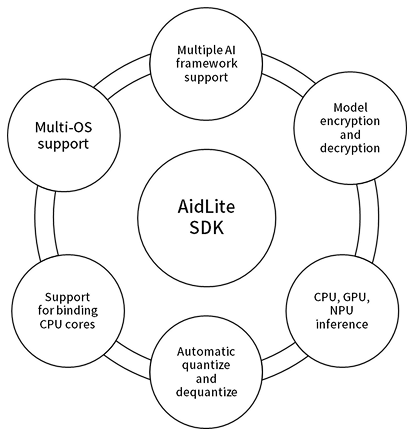

# AidLite SDK

## Introduction

**AidLite SDK** is an AI execution framework developed by APLUX, designed to fully utilize the computing units (CPU, GPU, NPU) of edge devices to achieve accelerated AI model inference.

AidLite standardizes AI inference middleware across platforms. It abstracts calls to different AI frameworks into a unified API, allowing for decoupled and flexible model inference development.

- Compatible with mainstream AI frameworks.
- Supports proprietary frameworks of AI chip vendors (Qualcomm, RockChip, etc.) and enables calls to vendor-specific AI compute units (NPU).

The features are illustrated below:

AidLite's highly unified API abstraction supports different AI frameworks, allowing developers to build once and deploy across different chips and frameworks. This greatly reduces learning costs and platform migration difficulties, enabling flexible technical choices and faster product deployment.

## Supported Matrix

**Operating System Support**

|  |  **Linux**  | **Android** |
|:------------:|:-----------:|:-----------:|
| **C++**      |     ✅      |     ／      |
| **Python**   |     ✅      |     ／      |
| **Java**     |     ／      |     ✅      |

**AI Framework Support**

||**Qualcomm SNPE**|**Qualcomm QNN**|**RKNN**|**TFLite**|**ONNX**|
|:----:|:----:|:----:|:----:|:----:|:----:|
|**AidLite for Linux**|✅|✅|✅|✅|🚧|
|**AidLite for Android**|✅|✅|✅|✅|🚧|

✅: Supported  
🚧: Planing

## Resources

- [AidLite User Guide](https://docs.aidlux.com/en/guide/software/sdk/aidlite/aidlite-sdk)
- [AidLite C++ API Documentation](https://docs.aidlux.com/en/guide/software/sdk/aidlite/aidlite-api-cpp)
- [AidLite Python API Documentation](https://docs.aidlux.com/en/guide/software/sdk/aidlite/aidlite-api-python)
- [Model Farm](https://aiot.aidlux.com/en/models)
- [AI Model Optimizer](https://aimo.aidlux.com/#/login)

## Quick Start

- [Installation](https://docs.aidlux.com/en/guide/software/sdk/aidlite/aidlite-sdk#installation)
- [Development Flowchart](https://docs.aidlux.com/en/guide/software/sdk/aidlite/aidlite-sdk#development-flowchart)
- [Development Workflow Explanation](https://docs.aidlux.com/en/guide/software/sdk/aidlite/aidlite-sdk#development-workflow-explanation)

## Use Case

- [Example: Run YOLOv5 Inference on Qualcomm NPU](https://docs.aidlux.com/en/guide/software/sdk/aidlite/aidlite-sdk#example)
- [Deploy YOLOv5s by Model Farm and inference by AidLite](https://docs.aidlux.com/en/guide/software/ai-platform-portal-modelFarm#deploy-yolov5s)

## Contact Us

- [contact APLUX](mailto:liuweibin@aidlux.com?cc=huangwenbo@aidlux.com) 